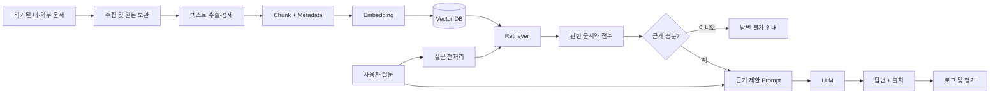

# [프로젝트명 미정] 내·외부 문서 기반 질의응답 시스템

> SKN AI 캠프 3차 단위 프로젝트 — LLM/RAG
>
> **문서 상태: 프로젝트 착수 전 초안**  
> 현재 확정된 것은 프로젝트 유형과 필수 산출물뿐입니다. 주제, 사용자, 문서, 벡터 DB, 화면, 평가 기준은 팀 회의 후 반드시 갱신합니다. 확정되지 않은 내용은 `TBD`로 표시합니다.

## 1. 프로젝트 개요

| 항목 | 현재 내용 |
| :--- | :--- |
| 프로젝트 주제 | LLM을 연동한 내·외부 문서 기반 질의응답 시스템 |
| 핵심 기술 | RAG, Prompt Engineering, Vector DB, LangChain, LangGraph, Fine-tuning 검토 |
| 프로젝트 기간 | `TBD` |
| 팀명 / 팀원 | `TBD` |
| 목표 사용자 | `TBD` |
| 해결할 문제 | `TBD` |
| 문서 범위 | `TBD` |
| 최종 실행 형태 | `TBD` (예: Streamlit) |

### 한 문장 목표

> `[목표 사용자]`가 `[문서 범위]`에 관해 질문하면, 시스템이 관련 문서를 검색하여 **출처와 함께 근거 기반 답변**을 제공하고, 근거가 부족하면 답변할 수 없음을 명확히 알린다.

### 성공 기준 초안

- 팀원이 같은 설치 절차로 애플리케이션을 실행할 수 있다.
- 답변에 사용한 문서명, 페이지 또는 URL 등 확인 가능한 출처를 표시한다.
- 평가 질문 세트에서 검색 품질과 답변 품질을 분리해 측정한다.
- 문서에 답이 없는 질문에는 추측하지 않고 근거 부족으로 답한다.
- API 키, 개인정보, 저작권 문제가 있는 원문을 GitHub에 올리지 않는다.

## 2. 수업 내용 기반 구현 원칙

프로젝트의 기본선은 수업에서 배운 `문서 → 청크 → 임베딩 → 벡터 저장소 → 검색 → 프롬프트 → LLM 답변` 흐름입니다.

1. **1단계(MVP): 기본 RAG**  
   소수의 허가된 문서와 평가 질문으로 끝까지 동작하는 RAG를 먼저 만듭니다.
2. **2단계: 검색·환각 방지 개선**  
   청크 크기, `top_k`, 메타데이터 필터, 프롬프트 등을 한 번에 하나씩 변경해 비교합니다.
3. **3단계: LangGraph 적용**  
   질문 분류, 검색 재시도, 답변 검증처럼 분기·반복·상태 관리가 실제로 필요한 경우에 적용합니다.
4. **4단계: Fine-tuning 검토**  
   Fine-tuning은 최신 문서 지식을 저장하는 기본 방법이 아닙니다. RAG 기준선으로 해결되지 않는 일정한 출력 형식, 말투 또는 분류 행동이 있고 학습·검증 데이터가 충분할 때만 비교 실험합니다.

> 기능 수보다 **문서 근거, 재현 가능한 평가, 실패 사례 분석**을 우선합니다.

## 3. 권장 MVP 범위

### 반드시 구현

- PDF/TXT/웹 문서 중 팀이 허가받은 형식 1~2종 로딩
- 문서 정제, 청크 분할, 메타데이터 부여
- OpenAI Embedding과 수업에서 사용한 벡터 DB 연결
- 질문과 유사한 문서 `top_k` 검색
- 검색 문맥만 근거로 답하는 프롬프트
- 답변과 출처 표시
- 답변 가능 질문 / 답변 불가 질문 테스트
- 간단한 사용자 화면 또는 실행 가능한 CLI

### 시간이 남을 때 선택

- Dense + BM25 Hybrid Search 및 RRF
- Metadata Filtering, Query Rewriting, Re-ranking
- LangGraph 기반 검색 재시도 또는 답변 검증
- 대화 이력 관리
- LangSmith 추적
- Fine-tuning 전후 비교 실험

### 초기 범위에서 제외 권장

- 수업에서 다루지 않은 대규모 인프라를 핵심 기능으로 도입
- 평가 데이터 없이 복잡한 Agent/Multi-Agent부터 구현
- 출처를 확인할 수 없는 웹 전체 자동 수집
- 원본 문서 지식을 모델에 넣기 위한 무조건적인 Fine-tuning

## 4. 시스템 흐름과 아키텍처 초안



LangGraph를 사용할 경우 `질문 분류 → 검색 → 근거 판정 → 답변 또는 검색 재시도`를 상태 그래프로 구성합니다. 단순 직선 흐름이면 우선 LangChain Runnable/Chain으로 구현합니다.

## 5. 디렉터리 구조 초안

```text
project/
├── README.md
├── CONTRIBUTING.md
├── requirements.txt
├── .env.example
├── .gitignore
├── .github/
│   ├── PULL_REQUEST_TEMPLATE.md
│   └── ISSUE_TEMPLATE/
├── app/                         # Streamlit 등 사용자 화면
├── src/
│   ├── config.py                # 환경 변수와 공통 설정
│   ├── ingestion/               # 문서 로딩·정제·청크·인덱싱
│   ├── retrieval/               # Vector DB와 Retriever
│   ├── generation/              # Prompt와 LLM 답변
│   ├── graph/                   # 필요한 경우 LangGraph 흐름
│   └── evaluation/              # 평가 실행 및 지표 계산
├── notebooks/                   # 탐색·실험용, 최종 로직은 src로 이동
├── tests/
│   ├── unit/                    # 함수 단위 테스트
│   └── evaluation/              # 질문·정답·기대 출처 평가
├── data/
│   ├── raw/                     # 원본: 공개 가능 여부에 따라 Git 제외
│   ├── processed/               # 정제/청크 데이터
│   └── evaluation/              # 평가 질문 세트
├── vectorstore/                 # 로컬 인덱스, 기본 Git 제외
├── outputs/                     # 실행·평가 결과, 선별하여 제출
└── docs/
    ├── 00_topic_selection/      # 주제 선정·회의·후속 검토 기록
    │   ├── 01_initial_review/
    │   ├── 02_meeting_records/
    │   ├── 03_post_meeting_reviews/
    │   └── 04_data_validation/
    ├── 01_project_definition.md
    ├── 02_data_preprocessing_report.md
    ├── 03_system_architecture.md
    ├── 04_test_plan_and_results.md
    └── decision_log.md
```

## 6. 기초 환경 설정

### 사전 준비

- Git 및 GitHub 계정
- 수업 권장 버전인 Python 3.12
- PyCharm 또는 VS Code / JupyterLab
- 팀원 개인별 API 키와 사용 한도
- 사용할 문서의 이용 허가, 개인정보 및 공개 가능 여부 확인

### 저장소 복제와 가상환경

```bash
git clone https://github.com/SpicyAutumn/SKN33-3rd-1Team.git
cd SKN33-3rd-1Team
python -m venv .venv
```

Windows PowerShell:

```powershell
.venv\Scripts\Activate.ps1
```

macOS/Linux:

```bash
source .venv/bin/activate
```

### 패키지 설치

```bash
python -m pip install --upgrade pip
python -m pip install -r requirements.txt
```

설치 확인:

```bash
python --version
python -c "import langchain, langgraph, openai; print('환경 설정 완료')"
```

### 환경 변수

```bash
cp .env.example .env
```

Windows PowerShell에서는 다음 명령을 사용합니다.

```powershell
Copy-Item .env.example .env
```

`.env`에 본인의 키를 입력합니다. **실제 키가 들어 있는 `.env`는 커밋하지 않습니다.** 키는 팀 채팅이나 문서로 공유하지 않고 팀원별로 발급합니다.

### 실행 명령 초안

아직 실행 파일이 정해지지 않았으므로 구현 후 아래를 실제 명령으로 교체합니다.

```bash
# 예시
python -m streamlit run app/app.py
```

## 7. 데이터 준비 원칙

문서는 “많을수록 좋다”가 아니라 **출처·권한·정답 근거를 확인할 수 있어야** 합니다.

| 확인 항목 | 기록 내용 |
| :--- | :--- |
| 문서 ID | 중복되지 않는 식별자 |
| 문서명 / 출처 | 파일명, 기관명, URL |
| 수집일 / 기준일 | 문서 최신성 판단 기준 |
| 사용 권한 | 공개, 허가, 사내 제한 등 |
| 파일 형식 | PDF, TXT, HTML 등 |
| 버전 | 개정 번호 또는 게시일 |
| 전처리 | 헤더·푸터 제거, OCR, 표 처리 등 |
| 메타데이터 | 페이지, 제목, 카테고리, 날짜 등 |

원본과 정제본을 분리하고, 전처리 전후 문서 수·페이지 수·청크 수와 제외 이유를 기록합니다. 문서가 갱신되면 같은 ID에 버전을 남기고 벡터를 `upsert`하거나 이전 인덱스를 교체하는 기준도 정합니다.

## 8. 환각 방지 설계

환각은 한 가지 설정으로 제거되지 않으므로 여러 층으로 줄입니다.

- **데이터:** 신뢰 가능한 문서만 사용하고 최신성·버전을 기록합니다.
- **검색:** 질문과 관련 없는 청크가 들어오는 사례를 평가하고 `top_k`, 청크, 메타데이터를 조정합니다.
- **프롬프트:** 제공된 문맥만 사용하고, 근거가 없으면 모른다고 답하도록 지시합니다.
- **출력:** 답변 문장에 대응하는 문서명·페이지·URL을 표시합니다.
- **거절:** 검색 결과가 없거나 근거가 불충분할 때 안전한 답변 불가 문구를 사용합니다.
- **평가:** 일반 질문뿐 아니라 문서 밖 질문, 모호한 질문, 잘못된 전제를 포함한 질문을 테스트합니다.

프롬프트 초안:

```text
당신은 제공된 문서를 근거로 답하는 질의응답 도우미입니다.
1. CONTEXT에 있는 정보만 사용하세요.
2. 근거가 부족하면 추측하지 말고 "제공된 문서에서 확인할 수 없습니다"라고 답하세요.
3. 답변 뒤에 근거 문서명과 페이지 또는 URL을 표시하세요.
4. 서로 충돌하는 문서가 있으면 충돌 사실과 각 출처를 함께 설명하세요.
```

## 9. 테스트 및 평가 기준

LLM 답변은 실행할 때 달라질 수 있으므로 “정답 문자열 완전 일치”만 사용하지 않습니다.

### 평가 데이터 구성

- 문서에서 직접 답할 수 있는 질문
- 여러 문서를 함께 찾아야 하는 질문
- 비슷한 용어를 구분해야 하는 질문
- 문서에 답이 없어 거절해야 하는 질문
- 잘못된 전제·모호한 표현이 있는 질문

각 질문에 `question`, `expected_answer`, `expected_source`, `answerable`, `category`를 기록하고, 개발 중 조정하는 세트와 최종 평가 세트를 분리합니다.

### 핵심 평가 항목

| 영역 | 확인할 내용 | 예시 측정 방법 |
| :--- | :--- | :--- |
| 검색 | 정답 근거가 상위 k개에 포함되는가 | Hit@k / 수동 확인 |
| 답변 | 질문에 맞고 근거와 일치하는가 | 0~2점 평가표 |
| 출처 | 표시된 출처가 실제 답변을 뒷받침하는가 | 정확/부분/오류 |
| 거절 | 답 없는 질문에 추측하지 않는가 | 거절 정확도 |
| 성능 | 사용자가 기다릴 수 있는가 | 평균 응답 시간 |
| 비용 | 반복 평가가 가능한가 | 질문당 토큰·비용 |

비교 실험은 한 번에 하나만 바꿉니다. 예: `chunk_size 500 ↔ 1000`, `top_k 3 ↔ 5`. 모델, 프롬프트, 데이터, 검색 설정을 동시에 바꾸면 개선 원인을 판단하기 어렵습니다.

## 10. 제출 산출물 연결

| 필수 산출물 | 저장 위치 | 완료 기준 |
| :--- | :--- | :--- |
| 수집 데이터 및 전처리 문서 | `data/`, `docs/02_data_preprocessing_report.md` | 출처·권한·정제·청크·통계·한계 기록 |
| 시스템 아키텍처 | `docs/03_system_architecture.md` | 인덱싱/질의 흐름, 구성 요소, 선택 근거 포함 |
| 개발 소프트웨어 | `src/`, `app/`, `requirements.txt` | 새 환경에서 설치·실행 가능 |
| 테스트 계획 및 결과 | `tests/`, `docs/04_test_plan_and_results.md` | 평가 세트, 조건, 결과, 실패 분석 포함 |

## 11. Git & GitHub 협업

- `main`은 항상 실행 가능한 상태로 유지하고 직접 push하지 않습니다.
- 모든 작업은 최신 `main`에서 `feature/*`, `fix/*`, `docs/*`, `test/*`, `chore/*` 브랜치를 만들어 진행합니다.
- 한 PR에는 한 가지 목적만 담고 최소 1명의 승인 후 병합합니다.
- 노트북은 출력이 불필요하면 지워 충돌과 용량을 줄입니다.
- 커밋 전 `git status`와 변경 내용을 확인해 `.env`, 원본 제한 문서, 벡터 인덱스가 포함되지 않았는지 점검합니다.

자세한 절차는 [CONTRIBUTING.md](CONTRIBUTING.md)를 참고합니다.

## 12. 프로젝트 주제 선정 자료

2026-08-25 1차 주제 선정부터 2026-08-26 2차 회의와 회의 후속 보완까지 진행했습니다. 현재 최종 주제와 후보 순위는 미확정이며, 우선 후보의 데이터 표본을 실제로 확보한 뒤 결정합니다.

- [주제 선정 진행 기록 및 권장 열람 순서](docs/00_topic_selection/README.md)
- [1차 주제 선정 및 사전 검토 기록](docs/00_topic_selection/01_initial_review/topic_selection_summary.md)
- [2026-08-26 2차 주제 선정 회의록](docs/00_topic_selection/02_meeting_records/topic_selection_meeting_2026-08-26.md)
- [2차 회의 결과 후속 이행 기록](docs/00_topic_selection/03_post_meeting_reviews/post_meeting_topic_refinement_log.md)
- [후보 주제 데이터 확보 가능성 검증서](docs/00_topic_selection/04_data_validation/data_feasibility_check.md)
- [의사결정 기록](docs/decision_log.md)

HTML 보고서는 방사형 그래프와 상세 비교표를 확인하는 시각화 자료이고, Markdown 문서는 GitHub에서 회의 내용과 결정 근거를 검토하기 위한 기록입니다.

## 13. 프로젝트 착수 회의에서 결정할 사항

- [ ] 사용자와 해결 문제, 사용 시나리오 3개
- [ ] 사용할 문서와 공개/저작권/개인정보 기준
- [ ] 답변 가능한 범위와 반드시 거절할 범위
- [ ] LLM, Embedding 모델, Vector DB
- [ ] 기본 RAG와 개선 실험 범위
- [ ] LangGraph가 필요한 구체적인 분기 또는 반복
- [ ] Fine-tuning 적용 여부와 적용 이유
- [ ] 화면 형태와 실행 환경
- [ ] 평가 질문 수, 최종 지표와 목표값
- [ ] 팀 역할, 일정, PR 리뷰 담당
- [ ] API 비용 한도와 장애 시 대체 방법

결정한 내용은 [docs/01_project_definition.md](docs/01_project_definition.md)와 [docs/decision_log.md](docs/decision_log.md)에 기록합니다.

## 14. 한계 및 향후 보완

이 저장소는 프로젝트 주제가 확정되기 전의 **출발용 템플릿**입니다. 현재의 아키텍처, 패키지, 폴더 구조, 평가 항목은 정답이 아니며 실제 데이터와 사용자 요구를 확인한 뒤 변경해야 합니다. 특히 Vector DB, Fine-tuning, LangGraph는 이름을 넣는 것이 목표가 아니라 문제 해결에 필요한지 실험으로 설명할 수 있어야 합니다.

## 15. A트랙: 한국민족문화대백과사전 원본 준비

이 단계는 일반 항목 CSV와 공식 OpenAPI의 일치성을 표본 감사하고, 팀이 명시적으로 선택한 EID의 JSON 원본과 추적 가능한 manifest를 만드는 데까지만 담당합니다. 미디어 메타데이터 CSV는 항목 본문과 단위가 다르고 자료별 저작권 확인이 필요하므로 수집하지 않습니다.

### API 키 설정

프로젝트 최상위에 `.env`를 만들고 발급받은 키만 직접 입력합니다. 키를 명령 인자에 넣거나 출력·로그·Git에 저장하지 않습니다.

```ini
AKS_API_KEY=발급받은_키
```

기본 URL은 `.env.example`의 `AKS_API_BASE_URL=https://devin.aks.ac.kr:8080/api`이며 보통 수정할 필요가 없습니다. 의존성을 설치하지 않았다면 먼저 다음을 실행합니다.

```bash
python -m pip install -r requirements.txt
```

### CSV·API 표본 감사

```bash
python scripts/audit_aks_api.py
```

기본값은 표본 25건, seed `20260828`입니다. CSV `분야`의 `/` 앞 대분야를 층으로 사용해 모든 대분야를 최소 1건 포함하고 나머지를 모집단 비율로 배분합니다. 재현 실험 시 값을 명시할 수 있습니다.

```bash
python scripts/audit_aks_api.py --sample-size 25 --seed 20260828
```

키가 없으면 API를 호출하지 않고 CSV 품질 검사·표본 선정·`missing_api_key` 기록까지만 안전하게 수행합니다. 키를 설정한 뒤 같은 명령을 다시 실행하면 `data/raw/api_audit/{EID}.json`과 비교 결과가 갱신됩니다.

### 선택 EID 원본 수집

`data/selection/selected_eids.csv`의 `eid` 열에 팀이 최종 선택한 EID만 한 줄씩 넣은 뒤 실행합니다.

```csv
eid
E0000002
E0000003
```

```bash
python scripts/collect_selected_aks.py
```

이 명령은 선택 파일에 있는 유효한 EID만 `data/raw/api/{EID}.json`으로 저장합니다. 빈 선택 파일, 잘못된 EID, 일반 항목 CSV에 없는 EID는 전수 수집으로 확대하지 않습니다.

전체 수집은 API 제공 조건과 저장 공간을 검토한 뒤에만, 의도적으로 `--all`을 붙여 실행합니다. 중단 후 같은 명령을 실행하면 이미 저장된 JSON은 건너뛰며, 진행 상태는 `outputs/api_full_collection_progress.json`에서 확인합니다.

```bash
python scripts/collect_all_aks.py --all
```

### 결과와 manifest 확인

- `data/manifest.csv`: EID별 출처, 수집 시각, SHA-256, 원본 경로, 본문 길이, 라이선스 메모, 상태·오류
- `outputs/csv_api_comparison.csv`: 표본별 CSV/API 비교
- `outputs/csv_api_audit.json`: 통계와 기계 판독 결과
- `outputs/csv_api_audit_report.md`: 사람이 읽는 감사 보고서
- `docs/document-card.md`: 출처, 이용 조건, 원본 보관 정책, 미디어 제외 기준

원본 JSON과 manifest의 체크섬·EID·본문·경로 연결을 전수 점검하려면 다음을 실행합니다.

```bash
python scripts/validate_aks_collection.py
```

단위 테스트는 네트워크와 실제 키 없이 모의 API 응답으로 실행합니다.

```bash
python -m pytest -q
```
