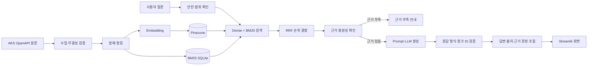

# 한국민족문화대백과사전 기반 수준별 문화유산 RAG 안내 서비스

> SKN AI 캠프 3차 단위 프로젝트 — LLM/RAG 1팀
>
> 문서 기준일: 2026-09-01
>
> 현재 상태: 데이터·검색 기반 구현 완료, 생성 모델·UI 통합 검토 중

한국민족문화대백과사전의 공식 자료를 검색하여 사용자의 이해 수준에 맞는 설명과 원문 출처를 제공하는 RAG 기반 문화유산 안내 서비스입니다.

시스템은 검색 결과에 없는 출처를 LLM이 임의로 만들지 않도록 답변에 사용한 청크를 검사합니다. 근거가 부족하거나 질문이 모호한 경우에는 추측해서 답하기보다 근거 부족 또는 추가 질문으로 안내하는 것을 목표로 합니다.

> 현재 프로젝트명은 설명형 임시 명칭입니다. 최종 서비스명은 팀 합의 후 변경할 수 있습니다.

## 1. 핵심 기능

- 한국민족문화대백과사전 OpenAPI 원문 수집·검증
- 원문 정제, 청킹, 메타데이터 및 추적용 식별자 생성
- OpenAI 임베딩과 Pinecone을 이용한 의미 기반 Dense 검색
- 제목·별칭·본문의 정확한 단어를 찾는 BM25 검색
- Dense와 BM25 순위를 RRF로 결합하는 Hybrid 검색
- `easy`, `general`, `advanced` 수준별 답변 계약
- 답변, 근거 부족, 추가 확인, 잘못된 전제 정정 등 여섯 가지 응답 유형
- 실제 검색 청크와 답변에 사용한 청크를 연결한 출처·근거 표시
- Streamlit 기반 질문·답변 과정·평가·탐험 화면

## 2. 현재 구현 상태

README의 상태는 최신 `main`과 발표 전 검토 중인 작업을 구분해 표시합니다.

| 영역 | 상태 | 현재 기준 |
| :--- | :---: | :--- |
| 원본 수집·검증 | 완료 | 상세 원본 75,835건, JSONL 오류·중복·누락 0건 |
| 정제·청킹 검증 | 완료 | 문서 75,820건, 청크 179,028건, 누락·중복·필드 오류 0건 |
| Pinecone Dense 검색 | 완료 | `aks-rag-v1` / 기본 namespace / `text-embedding-3-small` |
| BM25·Hybrid 검색 | 완료 | Dense와 BM25 후보를 RRF로 결합 |
| 검색 평가 | 완료 | Dev 25문항과 고유명사 회귀 5문항 비교 |
| RAG 입출력 계약 | 기본 구현 완료 | `RetrievedContext`, `GenerationRequest`, `ServiceResponse` 계약과 검증 |
| Prompt·생성 평가 기준 | 검토 중 | Prompt Baseline과 Fine-tuning 비교 기준 PR 검토 |
| 생성 컴포넌트 | 검토 중 | 특정 API에 종속되지 않는 기본 구조 PR 검토 |
| 실제 LLM 연결 | 예정 | 사용할 API 모델·비용 확인 후 소규모 Baseline 실행 |
| Streamlit 통합 | Draft 검토 중 | 현재 `main` 화면은 Mock 중심이며 실제 RAG 연결 PR 검토 중 |
| Fine-tuning | 미실행 | Prompt Baseline 결과를 확인한 뒤 필요성과 효과를 판단 |

관련 작업의 병합 상태가 바뀌면 위 표와 실행 방법을 함께 갱신합니다.

## 3. 전체 처리 흐름



Hybrid 검색의 RRF 점수는 Pinecone cosine similarity와 범위와 의미가 다릅니다. 따라서 Dense 실험에서 사용했던 `0.40` 기준선을 RRF 결과에 그대로 적용하지 않습니다. 현재 Hybrid 기준에서는 점수 기준선을 비워 두고 별도의 근거 확인 단계가 문맥의 충분성을 판단하도록 설계했습니다.

## 4. 데이터

### 출처

- 기관: 한국학중앙연구원(AKS, Academy of Korean Studies)
- 서비스: 한국민족문화대백과사전
- 방식: 공식 OpenAPI의 목록·상세 API
- 텍스트 출처 표기: `항목명 - 한국민족문화대백과사전 (한국학중앙연구원)`
- 이미지·영상·음성: 항목별 권리 조건이 달라 이번 corpus에서 제외

### 규모와 검증 결과

| 구분 | 결과 |
| :--- | ---: |
| 상세 원본 JSON | 75,835건 |
| 본문 없는 제외 항목 | 15건 |
| 최종 corpus 문서 | 75,820건 |
| 최종 청크 | 179,028건 |
| JSON 파싱 오류 | 0건 |
| 중복 청크 ID | 0건 |
| manifest 대상 문서 누락 | 0건 |
| corpus 제외 대상 포함 | 0건 |

원본 JSON·JSONL과 생성된 BM25 DB는 용량과 이용 조건 때문에 Git에 올리지 않습니다. 팀 공유 드라이브에서 전달받은 파일의 이름과 체크섬을 유지하고, 자세한 출처·보관·검증 기준은 [데이터 문서 카드](docs/document-card.md)와 [전처리 보고서](docs/02_data_preprocessing_report.md)를 확인합니다.

### 청크와 검색 문맥

청크는 정의(`definition`)와 본문(`body`)을 구분하며, 검색 결과는 다음 공통 필드를 반환합니다.

```text
chunk_id, document_id, title, content, source_url,
section, retrieval_rank, retrieval_score, score_type, metadata
```

답변 생성에는 `content`를 근거로 사용하고, 제목·시대·유형·별칭 등은 검색 보조 정보와 출처 추적에 사용합니다. 세부 형식은 [RetrievedContext 계약](docs/retrieved_context_contract.md)을 참고합니다.

## 5. 검색 방식과 평가 결과

### 검색 방식

- **Dense**: 질문과 문서의 의미적 유사성을 OpenAI 임베딩과 Pinecone cosine similarity로 검색합니다.
- **BM25**: 제목·별칭·본문에 포함된 정확한 단어를 로컬 SQLite FTS5 인덱스로 검색합니다.
- **Hybrid**: 두 검색기의 점수를 직접 더하지 않고 각 결과의 순위를 RRF 방식으로 결합합니다.

현재 Hybrid 초기 기준은 다음과 같습니다.

```text
Dense 후보 10개 + BM25 후보 10개
RRF k = 60
Dense 가중치 = 1.5
BM25 가중치 = 1.0
최종 top_k = 3
```

이 값들은 Dev 비교에서 사용한 첫 기준값이며 서비스의 영구 확정값은 아닙니다.

### Dev 25문항 결과

| 방식 | Hit@1 | Hit@3 | MRR | 평균 검색 시간 |
| :--- | ---: | ---: | ---: | ---: |
| Dense | 0.76 | 0.88 | 0.800 | 0.492초 |
| BM25 | 0.20 | 0.32 | 0.260 | 0.487초 |
| Hybrid | **0.76** | **0.92** | **0.820** | 0.979초 |

Hybrid는 Dense보다 정답 문서를 상위 3개 안에 포함한 질문이 22건에서 23건으로 늘었고 MRR도 높아졌습니다. 반면 평균 검색 시간은 증가했습니다.

### 문화재 고유명사 5문항 결과

| 방식 | Hit@1 | Hit@3 | MRR |
| :--- | ---: | ---: | ---: |
| Dense | 0.60 | 0.80 | 0.667 |
| BM25 | **1.00** | **1.00** | **1.000** |
| Hybrid | **1.00** | **1.00** | **1.000** |

`종묘`, `향원정`처럼 이름이 비슷한 다른 문서가 먼저 검색되는 사례에서 BM25 신호가 정확한 원문 제목을 찾는 데 도움이 됐습니다. 다만 5문항은 고유명사 문제를 확인하기 위한 작은 회귀 세트이므로 전체 질문 성능으로 확대 해석하지 않습니다.

- [Hybrid 검색 실행 가이드](docs/hybrid_retrieval_guide.md)
- [Dense·BM25·Hybrid 평가 보고서](docs/hybrid_retrieval_evaluation_report.md)
- [문화재 고유명사 회귀 보고서](docs/named_heritage_retrieval_regression_report.md)

## 6. 답변 생성과 출처 검증

### 설명 수준

| 코드 | 용도 | 권장 길이 |
| :--- | :--- | :--- |
| `easy` | 쉬운 단어와 짧은 문장 중심 | 약 100자 |
| `general` | 배경과 핵심 특징을 함께 설명 | 약 500자 |
| `advanced` | 맥락과 전문 내용을 더 자세히 설명 | 약 500~900자 |

글자 수는 문장을 억지로 자르는 절대 제한이 아니라 설명 수준의 차이를 확인하기 위한 권장 범위입니다.

### 응답 유형

| 코드 | 사용자에게 보여주는 의미 |
| :--- | :--- |
| `answered` | 검색 근거로 정상 답변 |
| `insufficient_evidence` | 답변에 필요한 근거가 부족함 |
| `needs_clarification` | 대상을 특정하기 위한 추가 질문이 필요함 |
| `corrected_premise` | 질문의 잘못된 전제를 근거로 정정함 |
| `safety_refusal` | 비밀 정보·Prompt Injection 등 안전상 거절함 |
| `out_of_scope` | 문화유산 안내 서비스 범위를 벗어남 |

생성 모델은 답변에 사용한 `used_chunk_ids`를 반환합니다. RAG Service는 이 ID가 같은 요청에서 실제로 검색된 청크인지 검사하고, 유효한 청크의 제목·URL·본문을 복사해 Citation을 구성합니다. 검색되지 않은 ID를 출처로 제시하면 사용자 응답 유형이 아니라 시스템 검증 오류인 `generation_error`로 처리합니다.

- [Track B 생성 계약](docs/track_b/02_generation_contract.md)
- [Prompt Baseline](docs/track_b/03_prompt_baseline.md)
- [생성·Fine-tuning 평가 기준](docs/track_b/04_generation_evaluation_criteria.md)

## 7. 설치와 실행

### 준비 사항

- Python 3.12 권장
- Git
- 실제 검색 시 OpenAI API 키와 Pinecone API 키
- 전체 Hybrid 검색 시 팀 공유 드라이브의 청크 JSONL

### 저장소와 가상환경

```powershell
git clone https://github.com/SpicyAutumn/SKN33-3rd-1Team.git
cd SKN33-3rd-1Team
python -m venv .venv
.\.venv\Scripts\Activate.ps1
python -m pip install --upgrade pip
python -m pip install -r requirements.txt
```

macOS/Linux에서는 가상환경을 다음과 같이 활성화합니다.

```bash
source .venv/bin/activate
```

### 환경 변수

```powershell
Copy-Item .env.example .env
```

`.env`에는 본인이 발급받은 값을 입력합니다. 실제 키는 Git, 문서, 화면 또는 채팅에 올리지 않습니다.

```ini
OPENAI_API_KEY=...
OPENAI_EMBEDDING_MODEL=text-embedding-3-small

PINECONE_API_KEY=...
PINECONE_INDEX_NAME=aks-rag-v1
PINECONE_NAMESPACE=

RAG_TOP_K=3
RAG_MIN_RETRIEVAL_SCORE=
```

`PINECONE_NAMESPACE`를 비워 두면 현재 v1 전체 데이터가 있는 기본 namespace를 사용합니다. Hybrid의 RRF 점수에는 Dense 기준선 `0.40`을 적용하지 않으므로 `RAG_MIN_RETRIEVAL_SCORE`도 비워 둡니다.

### Streamlit 화면

```powershell
python -m streamlit run app/app.py
```

현재 `main`의 Streamlit 앱은 UI 흐름을 확인하기 위한 Mock 중심 화면입니다. 실제 Pinecone 검색·LLM 답변·평가 결과 연결은 통합 작업의 병합 상태를 확인한 뒤 README를 갱신합니다.

### Hybrid 검색

팀 공유 드라이브에서 받은 `aks_full_chunks.jsonl`을 다음 위치에 둡니다.

```text
data/processed/aks_full_chunks.jsonl
```

```powershell
# 로컬 BM25 인덱스 생성
.\.venv\Scripts\python.exe scripts\build_aks_bm25.py

# Pinecone Dense와 BM25를 결합해 검색
.\.venv\Scripts\python.exe scripts\search_hybrid_aks.py "경복궁에 대해 알려줘" --top-k 3
```

이 검색은 질문 임베딩을 위해 OpenAI API를 호출하고 Pinecone을 읽기 전용으로 조회합니다. 벡터를 다시 적재하거나 변경하지 않습니다.

## 8. 테스트와 평가

### 자동 테스트

```powershell
python -m pytest
```

자동 테스트는 데이터 처리, 청크 계약, 검색 결합, RAG Service 계약, 응답 유형과 평가 데이터 형식을 확인합니다. 실제 외부 API 연결과 답변 품질은 별도의 소규모 실행 및 사람 검토가 필요합니다.

### 검색 평가 재실행

```powershell
.\.venv\Scripts\python.exe scripts\evaluate_hybrid_retrieval.py --top-k 3
```

이 명령은 Dev 검색 평가 대상 25문항을 Pinecone에 읽기 전용으로 질의하고 OpenAI Embeddings API를 호출합니다.

### 프로젝트 평가 범위

산출물 안내의 평가 방법 중 현재 프로젝트가 실제로 사용한 기술을 중심으로 다음을 기록합니다.

| 대상 | 핵심 확인 내용 | 지표·방법 |
| :--- | :--- | :--- |
| 데이터셋 | 결측·중복·누락·출처·처리 결과 | 문서·청크 수, 오류 수, 체크섬 |
| Retriever·Hybrid | 정답 문서가 상위에 검색되는가 | Hit@1, Hit@3, MRR, 평균 검색 시간 |
| 생성 답변 | 질문과 근거에 맞고 수준을 구분하는가 | 자동 계약 검사, 평가표, LLM 보조 평가, 사람 표본 검토 |
| 환각·출처 | 근거 밖 내용을 만들지 않는가 | 근거 충실성, 인용 정확성, `used_chunk_ids` 검사 |
| 시스템 통합 | 질문부터 답변·출처까지 이어지는가 | E2E 성공 여부, 응답시간, 오류 기록 |
| Fine-tuning | 적용 전후 품질이 실제로 개선되는가 | 동일 조건 비교; 미실행 시 결과로 주장하지 않음 |

현재 사용하지 않은 Reranker, LangGraph Agent, Tool Calling, GraphRAG 등의 평가는 제출 항목 수를 채우기 위해 임의로 추가하지 않습니다.

## 9. 저장소 구조

```text
.
├── app/                    # Streamlit 화면과 화면 구성요소
├── data/
│   ├── evaluation/        # Dev·Holdout·회귀 평가 질문
│   ├── manifest.csv       # 원본 추적표
│   ├── processed/         # 대용량 처리 결과는 Git 제외
│   └── raw/               # 원본 데이터는 Git 제외
├── docs/                   # 설계·계약·평가·결정 기록
├── outputs/                # 검증 보고서와 로컬 평가 결과
├── scripts/                # 수집·검증·청킹·검색·평가 실행 파일
├── src/
│   ├── aks_data/          # AKS 데이터 수집·설정
│   ├── evaluation/        # 평가 사례·서비스 지표
│   ├── rag_indexing/      # 청킹·Pinecone·BM25·Hybrid 검색
│   └── rag_service/       # 근거 판정·안전·응답 검증·Citation 조립
├── tests/                  # 자동 테스트
├── .env.example
├── requirements.txt
└── README.md
```

## 10. 제출 산출물 준비

| 제출 파일 | 저장소의 근거 자료 | 준비 상태 |
| :--- | :--- | :---: |
| `1팀_수집_및_전처리_데이터.zip` | `data/manifest.csv`, 데이터 문서 카드, 전처리·검증 자료 | 패키징 필요 |
| `1팀_시스템_아키텍처.PNG 또는 PDF` | `docs/03_system_architecture.md`, 실제 통합 구조 | 이미지/PDF 제작 필요 |
| `1팀_RAG기반_LLM(프로젝트명).zip` | 전체 코드, `requirements.txt`, 이 README | 최종 병합 후 패키징 |
| `1팀_테스트계획_및_결과보고서.pdf` | 검색 보고서, 생성 평가 기준, 통합 테스트 결과 | 최종 결과 취합·PDF 제작 필요 |

GitHub의 원본 데이터·비밀 키 제외 원칙과 제출용 ZIP의 포함 범위는 다를 수 있으므로, 최종 패키징 전에 파일 목록과 공개 가능 여부를 다시 확인합니다.

## 11. 팀 역할

| 이름 | 주요 담당 |
| :--- | :--- |
| 채수환 | 프로젝트 목표·범위, 일정, 작업 조정, 결과물 통합 |
| 김유진 | API 수집, 원본 저장, 출처·라이선스, manifest |
| 권세진 (팀장) | 정제·청킹·임베딩·Vector DB·Retriever·검색 평가 |
| 신가을 | Prompt Baseline, 생성 평가, Fine-tuning 데이터·학습·비교 |
| 이준희 | RAG Chain, LLM 연동, 근거 판정, Citation, 안전·통합 평가 |
| 김문규 | Streamlit, UX, 실제 응답 연결, 시연·배포·발표 |

담당 영역은 주 책임을 뜻하며, 연결되는 계약과 최종 결과는 관련 담당자가 함께 확인합니다.

## 12. 현재 한계와 향후 확장

- 실제 Chat 모델과 생성 컴포넌트 연결 및 공식 Baseline 결과가 아직 확정되지 않았습니다.
- 의미 기반 EvidenceChecker와 Hybrid 검색의 최종 통합 상태를 확인해야 합니다.
- Streamlit의 실제 검색·생성·평가 연결은 Draft 검토 결과에 따라 갱신해야 합니다.
- Dev 25문항과 고유명사 5문항은 초기 비교용이므로 더 큰 Holdout 평가가 필요합니다.
- 사용자의 오타를 후보로 보정하는 기능은 아직 없습니다.
- 여러 질문을 한 문장에 입력했을 때 하위 질문별로 검색하고 근거를 판정하는 기능은 아직 없습니다.
- 문서당 최대 청크 수, `top_k`, 후보 수, RRF 가중치는 한 조건씩 추가 비교해야 합니다.
- Reranker와 Fine-tuning은 Baseline에서 실제 필요성이 확인될 때 후속 실험으로 검토합니다.

오타 확인, 복합 질문 분해, 하위 질문별 근거 판정, 재정렬 모델 비교는 4차 프로젝트 확장 후보로 관리합니다.

## 13. 관련 문서

- [프로젝트 정의](docs/01_project_definition.md)
- [데이터 전처리 보고서](docs/02_data_preprocessing_report.md)
- [시스템 아키텍처](docs/03_system_architecture.md)
- [테스트 계획 및 결과](docs/04_test_plan_and_results.md)
- [데이터 문서 카드](docs/document-card.md)
- [의사결정 기록](docs/decision_log.md)
- [Track B 역할과 범위](docs/track_b/01_role_and_scope.md)
- [Track B 생성 계약](docs/track_b/02_generation_contract.md)

## 14. 보안과 이용 조건

- `.env`, API 키, 비밀번호, 토큰을 Git에 올리지 않습니다.
- 원본 JSON·JSONL, BM25 DB, 벡터 파일은 저장소에 포함하지 않습니다.
- 사용한 문서의 기관·항목명·원문 URL을 표시합니다.
- 한국민족문화대백과사전의 텍스트와 미디어 이용 조건을 구분합니다.
- 외부 API 평가를 반복 실행하기 전에 호출량과 비용을 확인합니다.
- 주요 변경은 Pull Request와 Review를 거쳐 병합합니다.

자세한 협업 방법은 [CONTRIBUTING.md](CONTRIBUTING.md)를 참고합니다.
