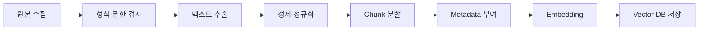

# 수집 데이터 및 데이터 전처리 보고서

## 1. 목적과 범위

- 질의응답 대상 지식 범위:
- 수집 시작일 / 종료일:
- 포함 기준:
- 제외 기준:

## 2. 데이터 출처와 권한

| ID | 문서명 | 제공 기관/작성자 | URL/입수 경로 | 게시·개정일 | 수집일 | 라이선스/허가 | 공개 가능 여부 |
| :--- | :--- | :--- | :--- | :--- | :--- | :--- | :--- |
| DOC-001 |  |  |  |  |  |  |  |

개인정보, 사내 기밀, 저작권 제한 자료가 있으면 실제 내용을 보고서에 복사하지 않고 처리 기준과 결과만 기록합니다.

## 3. 원본 데이터 구성

| 구분 | 문서 수 | 페이지/행 수 | 용량 | 형식 | 비고 |
| :--- | ---: | ---: | ---: | :--- | :--- |
| 전체 원본 |  |  |  |  |  |
| 최종 포함 |  |  |  |  |  |
| 제외 |  |  |  |  |  |

### 제외 문서

| 문서 ID | 제외 이유 | 처리일 |
| :--- | :--- | :--- |
|  | 중복 / 손상 / 권한 / 범위 밖 / 품질 |  |

## 4. 전처리 파이프라인



### 단계별 처리

1. 문서 로딩:
2. 텍스트 추출/OCR:
3. 헤더·푸터·중복 제거:
4. 표·목록·줄바꿈 처리:
5. 개인정보 비식별화:
6. 청크 분할:
7. 메타데이터 생성:
8. 품질 검증:

## 5. 청크 설계

- Splitter:
- `chunk_size`:
- `chunk_overlap`:
- 구분자/문서 구조 활용 방식:
- 이 값을 선택한 이유:

| 실험 ID | chunk_size | overlap | 청크 수 | 평균 길이 | 검색 결과/평가 | 결론 |
| :--- | ---: | ---: | ---: | ---: | :--- | :--- |
| CH-01 |  |  |  |  |  |  |

## 6. 메타데이터 스키마

| 필드 | 자료형 | 설명 | 예시 | 검색/출처 활용 |
| :--- | :--- | :--- | :--- | :--- |
| `document_id` | string | 문서 식별자 | `DOC-001` | 중복·갱신 관리 |
| `title` | string | 문서명 |  | 출처 표시 |
| `page` | integer | 원본 페이지 | 12 | 출처 표시 |
| `source` | string | URL 또는 경로 |  | 출처 표시 |
| `category` | string | 문서 분류 |  | 필터 검색 |
| `version` | string | 게시일/개정 번호 |  | 최신성 관리 |

## 7. 인덱싱 설정

- Embedding 모델:
- 벡터 차원:
- Vector DB / Index 이름:
- Distance metric:
- ID 생성 규칙:
- Insert / Upsert 기준:
- 문서 삭제·갱신 방법:

## 8. 전처리 결과와 검증

| 검증 항목 | 기대 결과 | 실제 결과 | 통과 여부 |
| :--- | :--- | :--- | :--- |
| 빈 청크 없음 | 0건 |  |  |
| 필수 메타데이터 누락 없음 | 0건 |  |  |
| 중복 청크 | 기준 이하 |  |  |
| 임의 표본 원문 대조 | 내용 유지 |  |  |
| 페이지 출처 대조 | 일치 |  |  |

전처리 전후 예시를 개인정보나 제한 정보가 없는 범위에서 2~3건 제시합니다.

## 9. 재현 방법

```bash
# 실제 전처리·인덱싱 명령으로 교체
python -m src.ingestion.run
```

- 필요한 환경 변수:
- 입력 위치:
- 출력 위치:
- 예상 실행 시간/비용:

## 10. 한계 및 향후 개선

- 스캔 PDF/OCR 오류:
- 표·이미지 정보 손실:
- 문서 최신성:
- 데이터 편향/누락:
- 이후 개선 계획:

