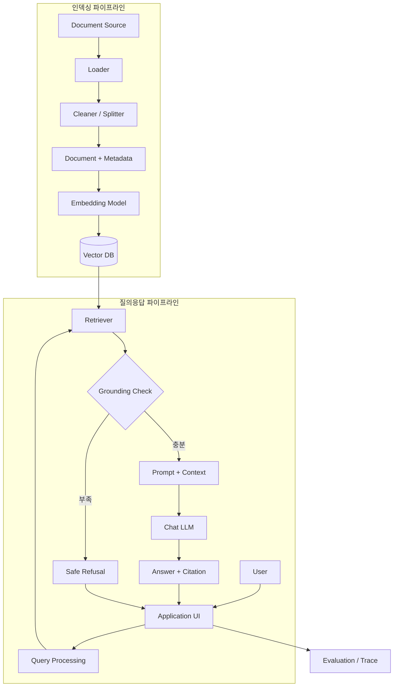

# 시스템 아키텍처

## 1. 설계 목표

- 사용자 질문에 관련 문서를 검색해 출처와 함께 답한다.
- 근거가 없으면 추측하지 않고 답변 불가를 안내한다.
- 인덱싱과 질문 처리를 분리해 문서 갱신과 장애 원인을 확인하기 쉽게 한다.
- 수업에서 배운 LangChain/LangGraph 구성 요소로 설명 가능한 구조를 사용한다.

## 2. 전체 구성도

실제 구현에 맞춰 이름과 연결을 갱신합니다.

## 3. 구성 요소

| 구성 요소 | 책임 | 입력 | 출력 | 선택 기술 |
| :--- | :--- | :--- | :--- | :--- |
| Loader | 문서 읽기 | PDF/TXT/URL | Document |  |
| Splitter | 청크 분할 | Document | Chunk |  |
| Embedding | 벡터화 | Chunk text | Vector |  |
| Vector DB | 저장·유사도 검색 | Vector/query | 관련 Chunk |  |
| Retriever | 검색 조건 적용 | Question | `list[Document]` | LangChain |
| Grounding Check | 근거 충분성 판단 | 검색 결과 | 분기 결과 | 규칙/LLM |
| Generator | 문맥 기반 답변 | Question+Context | Answer |  |
| Citation | 출처 구성 | Metadata | Sources |  |
| UI | 입력·출력 | User event | Screen |  |

## 4. 질의 처리 순서

1. UI가 사용자 질문을 받습니다.
2. 질문을 필요한 범위에서 정규화하거나 분류합니다.
3. Retriever가 Vector DB에서 관련 청크를 가져옵니다.
4. 검색 결과가 없거나 근거 기준을 만족하지 못하면 답변 불가로 분기합니다.
5. 충분한 청크와 질문을 Prompt에 넣습니다.
6. LLM이 문맥 안에서 답변을 생성합니다.
7. 청크 메타데이터로 문서명·페이지·URL을 표시합니다.
8. 질문, 검색 설정, 지연 시간, 평가 결과를 비밀정보 없이 기록합니다.

## 5. LangChain과 LangGraph 사용 범위

### LangChain

- Loader, Splitter, Embedding, Vector Store, Retriever 연결
- Prompt → Model → Parser의 Runnable/Chain 구성
- 각 단계 입출력을 함수 단위로 분리

### LangGraph

다음 중 실제 요구가 있을 때 사용합니다.

- 질문 유형에 따라 검색 경로 분기
- 검색 결과가 부족할 때 Query Rewrite 후 제한된 횟수만 재검색
- 답변 근거 검사 실패 시 재생성
- 대화 상태 또는 중간 결과 유지

| Node | 역할 | State 입력 | State 출력 | 실패/종료 조건 |
| :--- | :--- | :--- | :--- | :--- |
|  |  |  |  |  |

무한 반복을 막기 위한 최대 재시도 횟수와 오류 처리 방법을 적습니다.

## 6. 주요 설정

| 설정 | 값 | 환경 변수/파일 | 선택 근거 |
| :--- | :--- | :--- | :--- |
| Chat model |  | `OPENAI_CHAT_MODEL` |  |
| Embedding model |  | `OPENAI_EMBEDDING_MODEL` |  |
| Vector index |  | `PINECONE_INDEX_NAME` 등 |  |
| chunk_size / overlap |  | config |  |
| top_k |  | config |  |
| temperature |  | config |  |
| retry limit |  | config |  |

## 7. 오류·보안·비용 처리

- API 키는 환경 변수에서 읽고 로그나 화면에 출력하지 않습니다.
- 외부 API 타임아웃, 인증 실패, 사용량 제한을 사용자 메시지와 개발 로그로 구분합니다.
- 프롬프트와 로그에 원문 전체 또는 개인정보가 불필요하게 남지 않게 합니다.
- LLM 호출 전에 입력 길이를 제한하고, 재시도 횟수에 상한을 둡니다.
- 질문당 토큰과 응답 시간을 기록해 비용과 성능을 평가합니다.

## 8. 대안과 선택 근거

| 의사결정 | 선택 | 대안 | 선택 이유 | 현재 한계 |
| :--- | :--- | :--- | :--- | :--- |
| Vector DB |  |  |  |  |
| 검색 방식 | Dense | Hybrid |  |  |
| Workflow | Chain / Graph |  |  |  |
| Fine-tuning | 적용 / 미적용 | Prompt/RAG 개선 |  |  |

## 9. 배포·실행 구조

- 실행 환경:
- 시작 명령:
- 필수 환경 변수:
- 외부 서비스:
- 로컬/배포 환경 차이:
- 알려진 제약:

